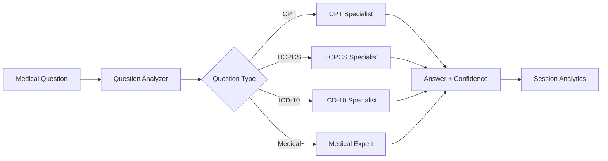

# CPC Multi-Agent Medical Coding System

> *AI agent for Certified Professional Coder (CPC) exam*

This system leverages the **OpenAI Agent Framework**, along with **Function Tools** and **WebTools** to successfully pass the CPC practice exam.

### **Key Innovations**
- **Multi-Agent Intelligence**: 5 specialized AI agents work together like a coding team
- **Medical Database Integration**: Direct access to Clinical Tables NLM databases
- **Smart Question Analysis**: Automatically routes questions to the right specialist
- **Confidence Scoring**: Each answer includes reliability metrics
- **Session Analytics**: Track performance and identify improvement areas

## Architecture Overview



## Quick Start

### Prerequisites
- Python 3.8+
- [Poetry](https://python-poetry.org/) for dependency management
- OpenAI API key

### Installation
```bash
git clone https://github.com/yourusername/cpc_project.git
cd cpc_project
poetry install  # Creates virtual environment and installs dependencies
```

### Basic Usage
```python
from cpc_agent import CPCAgent

# Initialize the system (Poetry manages the virtual environment)
agent = CPCAgent(api_key="your_openai_api_key")

# Ask a medical coding question
question = {"stem": "Patient receives MRI brain without contrast", "id": "q001"}
options = {"A": "70551", "B": "70552", "C": "70553", "D": "70554"}

answer = agent.answer_question(question, options)
print(f"Recommended code: {answer}")  # Returns: A, B, C, or D
```

## 📦 Project Structure

### **[CPC Agent System](cpc_agent/README.md)**
Multi-agent framework with 5 specialized AI agents for medical coding expertise

### **[Medical Coding APIs](apis/README.md)**
Comprehensive database access for medical coding standards (Conditions, Procedures, ICD-10-CM, HCPCS)

### **[CPC Parser](cpc_parser/README.md)**
PDF parsing engine for extracting structured question data from CPC practice test files

### 🛠️ **Additional Tools**
- **`main.py`**: Command-line interface for batch processing
- **`analyze_results.py`**: Performance analysis and reporting
- **`scripts/`**: Data processing and utility scripts

### 🔧 **Environment Management**
This project uses [Poetry](https://python-poetry.org/docs/basic-usage/) for dependency management and virtual environments:
```bash
poetry shell          # Activate virtual environment
poetry run python     # Run Python scripts
poetry add <package>   # Add new dependencies
```