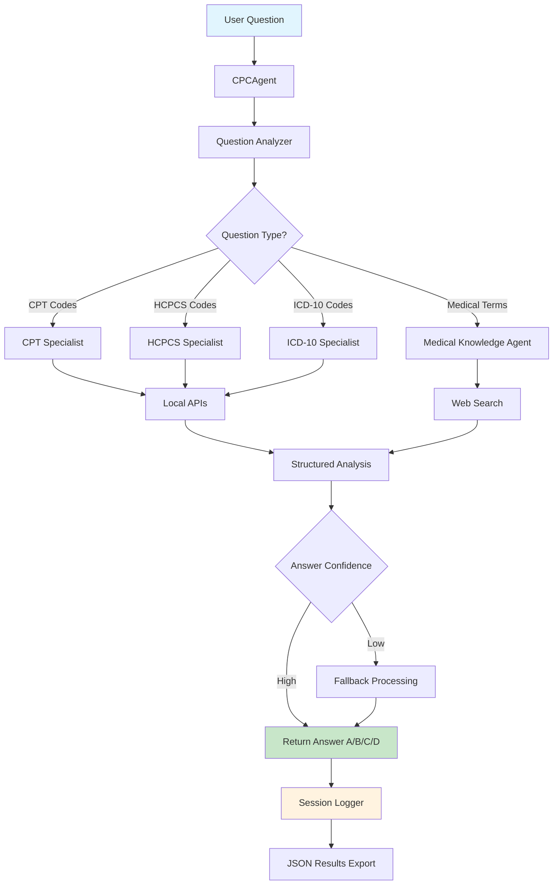

# CPC Medical Coding Agent

Multi-agent system for CPC exam preparation and medical coding assistance. Uses specialized AI agents to analyze questions and provide accurate coding solutions.

## Architecture

### **Main Components**
- **[CPCAgent](agent.py)**: Main orchestrator that coordinates all agents
- **[Question Analyzer](agents/question_analyzer.py)**: Routes questions to appropriate specialists  
- **[Logging System](logger.py)**: Tracks performance and saves results
- **[Function Tools](tools.py)**: Provides access to local medical coding APIs

### 🧠 **Specialized Agents**

#### **[CPT Specialist](agents/cpt_specialist.py)**
Expert in Current Procedural Terminology codes for medical procedures.
- Surgical, anesthesia, radiology, lab, and E&M codes
- Anatomical precision and procedure complexity analysis

#### **[HCPCS Specialist](agents/hcpcs_specialist.py)**
Expert in Level II HCPCS codes for equipment and supplies.
- DME, prosthetics, drugs, medical supplies
- Integration with [HCPCS database](https://clinicaltables.nlm.nih.gov/apidoc/hcpcs/v3/doc.html)

#### **[ICD-10 Specialist](agents/icd10_specialist.py)**
Expert in diagnostic codes and medical conditions.
- Complete ICD-10-CM diagnostic code set
- Integration with [ICD-10-CM database](https://clinicaltables.nlm.nih.gov/apidoc/icd10cm/v3/doc.html)

#### **[Medical Knowledge Agent](agents/medical_knowledge_agent.py)**
Expert in medical terminology, anatomy, and coding guidelines.
- HIPAA, Medicare guidelines, NCCI edits, modifier usage

### **Agent Orchestration Flow**



## Features

- **Multi-step Processing**: Question analysis → Specialist routing → Answer validation
- **[Structured Outputs](models.py)**: Pydantic models with confidence scoring
- **[Local API Integration](tools.py)**: Direct access to medical coding databases
- **Web Search**: Access to authoritative medical sources
- **[Session Analytics](logger.py)**: Performance tracking and JSON export
- **Error Handling**: Multi-layer fallbacks and comprehensive logging

## Usage

```python
from cpc_agent import CPCAgent

# Initialize
agent = CPCAgent(api_key="your_openai_api_key")

# Answer a question
question = {"stem": "MRI brain without contrast CPT code?", "id": "q001"}
options = {"A": "70551", "B": "70552", "C": "70553", "D": "70554"}

answer = agent.answer_question(question, options)
print(answer)  # Returns: A, B, C, or D
```

## Dependencies

- `openai`, `agents`, `pydantic`, local `apis` package
